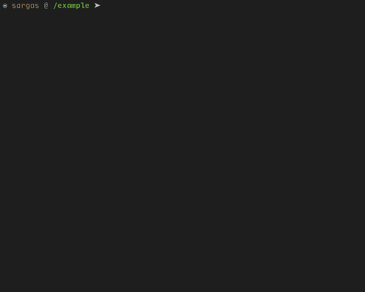

# ws

Unix CLI directory alias manager.

_Windows isn't supported mainly because I don't use _Command Prompt_, _PowerShell_, etc., PRs for
that are welcome._

In `ws` directories are called workspaces.

## Installation

Run on your terminal `go get github.com/andradei/ws`. Or download a version from the Releases page.

## Usage and Examples

```bash
$ ws help

ws - Directory alias manager

Usage: ws <command [workspace name]> | <workspace name>

  create | c <workspace name>
    Create a workspace with given name

  delete | d <workspace name>
    Delete an existing workspace by name

  help | h <workspace name>
    Display this help message

  list | l <workspace name>
    List existing workspaces


Examples:

  Create workspace:
    ws create project1

  Go to workspace:
    cd $(ws project1)

  Delete workspace:
    ws delete project1
```



When using the `ws <workspace name>` form, `ws` will output the directory of for the given
workspace name. So you can do the following:

```bash
cd $(ws my_workspace)
```

Another way to use it (how it is shown in the GIF), is to put the following function
in your `.bashrc` or `.zshrc`:

```bash
function wcd {
    cd $(ws $1)
}
```

So calling `wcd my_workspace` would also work.

## Development

You can run the scripts with `go run scripts/[file].go` or compile the script and run that, for
example `go build -o dist scripts/distribute.go` then `./scripts/dist`

- Compile to executable binaries: `go run scripts/distribute.go`
- Run tests and generate coverage files: `go run scripts/test.go`
